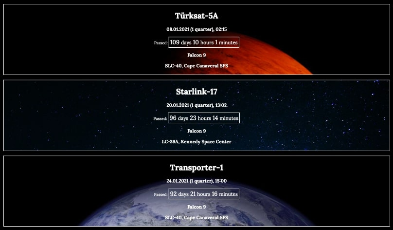

# spacex-launches-use-hooks (с использованием hooks)

На страницу нужно вывести список запусков компании SpaceX в 2021 году. Данные можно взять из [этого файла](https://raw.githubusercontent.com/denissokolov/tc-internship-task/master/launches.json). Список должен содержать название миссии, название носителя, место запуска и дату старта.
Рядом с датой старта нужно вывести таймер обратного отсчета, если известна точная дата пуска. Если пуск уже был, то таймер должен выводить время, прошедшее с времени запуска до текущего момента. Таймер должен быть в удобном для чтения формате, например, "123 дня 16 часов 3 минуты".
Важное условие: таймеры на странице должны обновляться в режиме реального времени, без перезагрузки страницы. Также страница может быть открыта сколько угодно долго, но должна продолжать показывать актуальную информацию.
Для выполнения задания можно использовать любые библиотеки, но предпочтение лучше отдать react js. Но нельзя использовать готовые компоненты, фреймворки и тп.
В качестве решения следует присылать ссылку на git репозиторий.

---

### Результат работы программы:

